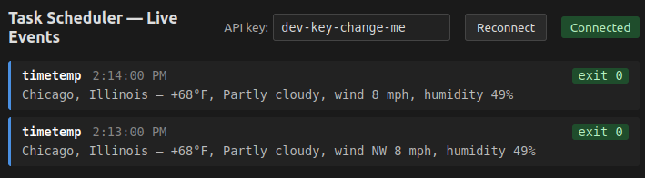

# Task Scheduler API

A self-hosted task scheduler that runs arbitrary shell commands on cron — `rsync`, `pg_dump`, a Python script, a healthcheck, a `claude -p` prompt — with a REST API. Because it runs on your LAN, tasks can reach a local database, NAS, internal service, or sensor, and outputs stay local. Optional browser window keeps up in real time with changes to scheduled task results (e.g. have claude fetch a city's weather every minute).



*Runs on Linux, macOS, and Windows. Requires Node.js 18+.*

## Setup

### 1. Install Node.js (18+)

**Linux (Ubuntu/Debian)** — recent LTS via NodeSource:
```bash
curl -fsSL https://deb.nodesource.com/setup_lts.x | sudo -E bash -
sudo apt-get install -y nodejs
```
(`setup_lts.x` is the literal URL — `.x` is NodeSource's "any minor in this line" convention, not a placeholder you fill in. `lts` tracks the current Long-Term-Support major, not the absolute newest Node release.)

**Linux (Fedora/RHEL)** — via `dnf`:
```bash
sudo dnf install -y nodejs npm
```

**macOS** — via Homebrew:
```bash
brew install node
```
Or grab the installer from https://nodejs.org.

**Windows** — via `winget` (built in on Win10+):
```powershell
winget install OpenJS.NodeJS.LTS
```
Or via Chocolatey:
```powershell
choco install nodejs-lts
```
Or download the MSI from https://nodejs.org and run the installer.

**Any platform — version manager (recommended for active development):**
- Linux/macOS: [`nvm`](https://github.com/nvm-sh/nvm) — `nvm install --lts && nvm use --lts`
- Windows: [`nvm-windows`](https://github.com/coreybutler/nvm-windows) — `nvm install lts && nvm use lts`

**Verify (any install path):**
```bash
node --version
npm --version
```

### 2. Install project dependencies

```bash
npm install
```

### 3. Open Windows firewall (LAN host only)

Windows Firewall blocks inbound TCP 3000 by default. If you're hosting on Windows and want LAN clients to reach the service, allow it once with (admin shell):
```cmd
netsh advfirewall firewall add rule name="cron-dispatcher" dir=in action=allow protocol=TCP localport=3000
```

### 4. Run as a service (optional)

To keep the scheduler running across reboots and logouts:

- **Linux**: write a `systemd` unit at `/etc/systemd/system/cron-dispatcher.service`, then `sudo systemctl enable --now cron-dispatcher`.
- **macOS**: write a `launchd` plist at `~/Library/LaunchAgents/cron-dispatcher.plist`, then `launchctl load` it.
- **Windows**: use [`nssm`](https://nssm.cc/) or [`node-windows`](https://github.com/coreybutler/node-windows).

## Run

```bash
# Default (port 3000, binds to all interfaces)
node index.js

# Custom port or localhost-only
PORT=4000 HOST=127.0.0.1 node index.js

# Set a real API key, or leave as dev-key-change-me while testing
API_KEY=your-secret-key node index.js
```

## Watch live in your browser

The server includes a static dashboard at `/` that subscribes to a Server-Sent Events stream of task run results — every time a scheduled or manually triggered task completes, its output appears in the page automatically.

Open `http://localhost:3000` (or `http://<lan-ip>:3000`) in any modern browser. The page authenticates the SSE connection via the `?key=` query string — change the API key field at the top of the page if you've set a custom `API_KEY`.

## Test: exercise REST interface

### Shorthand setup

Set up shell variables so the rest of the commands stay readable.

Linux/macOS (bash/zsh):
```bash
HOST=http://localhost:3000
KEY="dev-key-change-me"
```

Windows (`cmd.exe`):
```cmd
set HOST=http://localhost:3000
set KEY=dev-key-change-me
```
(reference them in cmd as `%HOST%` and `%KEY%`)

Windows (PowerShell):
```powershell
$HOST = "http://localhost:3000"
$KEY  = "dev-key-change-me"
```

If you're hitting the server from another machine on your LAN, replace `localhost` with the host's LAN IP:

- Linux: `ip addr` or `hostname -I`
- macOS: `ipconfig getifaddr en0` (or `ifconfig`)
- Windows: `ipconfig`

---

### 1. Health check (no auth needed)
```bash
curl $HOST/health | jq
```

### 2. Create a task that runs every minute

Linux/macOS:
```bash
curl -X POST $HOST/tasks \
  -H "Content-Type: application/json" \
  -H "x-api-key: $KEY" \
  -d '{
    "name": "heartbeat",
    "schedule": "* * * * *",
    "command": "echo \"alive at $(date)\""
  }' | jq
```

Windows:
```cmd
curl -X POST %HOST%/tasks ^
  -H "Content-Type: application/json" ^
  -H "x-api-key: %KEY%" ^
  -d "{\"name\":\"heartbeat\",\"schedule\":\"* * * * *\",\"command\":\"echo alive at %DATE% %TIME%\"}" | jq
```

Windows PowerShell:
```powershell
curl.exe -X POST $HOST/tasks `
  -H "Content-Type: application/json" `
  -H "x-api-key: $KEY" `
  -d '{"name":"heartbeat","schedule":"* * * * *","command":"powershell -Command \"echo (Get-Date)\""}' | jq
```
Copy the `id` from the response — you'll need it. Or use the next command to grab it.

### 3. List all tasks
```bash
curl $HOST/tasks -H "x-api-key: $KEY" | jq
```

Capture the ID into a variable for the rest of the walkthrough:
```bash
ID=$(curl -s $HOST/tasks -H "x-api-key: $KEY" | jq -r '.[0].id')
echo "Task ID: $ID"
```

### 4. Get one task by ID (includes output of most recently run task)
```bash
curl $HOST/tasks/$ID -H "x-api-key: $KEY" | jq
```

### 5. Trigger it immediately (don't wait for cron)
```bash
curl -X POST $HOST/tasks/$ID/run -H "x-api-key: $KEY" | jq
```

### 6. Pause the task
```bash
curl -X PATCH $HOST/tasks/$ID \
  -H "Content-Type: application/json" \
  -H "x-api-key: $KEY" \
  -d '{"status": "paused"}' | jq
```

### 7. Reschedule it (every 5 minutes instead) and reactivate
```bash
curl -X PATCH $HOST/tasks/$ID \
  -H "Content-Type: application/json" \
  -H "x-api-key: $KEY" \
  -d '{"schedule": "*/5 * * * *", "status": "active"}' | jq
```

### 8. Try a deliberately failing command (to see error capture)
```bash
curl -X POST $HOST/tasks \
  -H "Content-Type: application/json" \
  -H "x-api-key: $KEY" \
  -d '{
    "name": "broken",
    "schedule": "* * * * *",
    "command": "exit 42"
  }' | jq
```
Then trigger it and inspect `lastResult.exitCode` and `lastResult.stderr`.

### 9. Test auth rejection
```bash
curl $HOST/tasks | jq
# should return 401
```

### 10. Test invalid cron rejection
```bash
curl -X POST $HOST/tasks \
  -H "Content-Type: application/json" \
  -H "x-api-key: $KEY" \
  -d '{"name":"bad","schedule":"not-a-cron","command":"echo hi"}' | jq
# should return 400
```

### 11. Delete the task
```bash
curl -X DELETE $HOST/tasks/$ID -H "x-api-key: $KEY"
# returns 204 (no body — nothing to pipe to jq)
```

### 12. Confirm it's gone
```bash
curl $HOST/tasks -H "x-api-key: $KEY" | jq
```

---

**About `| jq`:** the examples above pipe each JSON response through [`jq`](https://jqlang.org) to pretty-print it. If you don't want to install jq, just drop the trailing `| jq` from any command — you'll get the same data, unformatted.

Install jq if you want it:
- Ubuntu/Debian: `sudo apt install jq`
- macOS: `brew install jq`
- Windows: `winget install jqlang.jq` (or `choco install jq`)

**PowerShell note:** the PowerShell example uses `curl.exe` (the real curl binary) rather than bare `curl`, because PowerShell aliases `curl` to `Invoke-WebRequest`, which returns a structured object — not a text stream — and won't pipe to `jq` cleanly. Real curl ships with Windows 10+ by default; install via `winget install curl` if missing.

## Example: scheduling Claude CLI tasks

The scheduler runs any shell command, so `claude -p "<prompt>"` is just another command — no integration code needed.

### 1. Install Claude Code on the server

Linux/macOS:
```bash
# Option A: via npm
npm install -g @anthropic-ai/claude-code

# Option B: install script
curl -fsSL https://claude.ai/install.sh | bash
```

Windows (PowerShell):
```powershell
# Option A: via npm
npm install -g @anthropic-ai/claude-code

# Option B: install script
irm https://claude.ai/install.ps1 | iex
```

**Verify (any install path):**
```bash
claude --version
```

### 2. Authenticate once

Run `claude` and follow the auth prompts. On first launch, Claude Code opens a browser window prompting you to log in to claude.ai. Credentials are persisted to disk so cron-triggered (headless) runs inherit them:
```bash
claude
```

### 3. Smoke-test the prompt directly

Confirm the CLI works in print mode before scheduling:
```bash
claude -p "What is current date and time?"
```

### 4. Register a scheduled task

Run hourly:
```bash
curl -X POST $HOST/tasks \
  -H "Content-Type: application/json" \
  -H "x-api-key: $KEY" \
  -d '{
    "name": "chicago-weather",
    "schedule": "0 * * * *",
    "command": "claude -p \"use curl to get current weather including temp, humidity, and wind speed from wttr.in for Chicago Illinois and add date/time from system clock in central timezone. Respond in plain text, no markdown.\" --allowedTools Bash"
  }'
```

### 5. Read the last result

```bash
curl -s $HOST/tasks/$ID -H "x-api-key: $KEY" | jq '.lastResult'
```

### Caveats

- The `command` field is a JSON string, so any double quotes inside the prompt must be escaped with a backslash. Write `"command": "claude -p \"your prompt here\""` to avoid an invalid JSON error.
- If a scheduled task fails with "claude: command not found", `claude` isn't on the scheduler's PATH. In that case, use the absolute path in the `command` field instead: `/path/to/claude -p "..."`. Run `which claude` (or `where claude` on Windows) from your shell to find that path.
- For structured output: run claude with `--output-format json`. The scheduler stores the raw stdout string in `lastResult.stdout`. To pull out individual fields, JSON-parse that string (e.g., pipe to `jq` in shell, or `JSON.parse` in code).
- The 60-second `exec` timeout applies. A prompt that triggers multiple tool calls (e.g., web search/fetch) can run longer; if you hit timeouts, raise the value in `lib/scheduler.js` or pre-fetch data in a wrapper script.

### Why this and not Claude Routines?

Claude Routines is Anthropic's hosted scheduler for recurring Claude prompts. It overlaps with the Claude-on-cron example above, but the two solve different problems:

**Claude Routines is the right choice when:**
- Your only goal is "run a Claude prompt on a schedule."
- You don't want to operate any server infrastructure.
- You want built-in delivery (email/notification) of results without writing plumbing.

**This scheduler is the right choice when:**
- You need to run **arbitrary shell commands** — `rsync`, `pg_dump`, a Python script, a healthcheck — not just Claude prompts. Claude is one use case, not the whole product.
- Tasks need **LAN access** to a local database, NAS, internal service, sensor, etc. A cloud-hosted scheduler can't reach those.
- You want **local-only outputs**: `lastResult` lives in `data/tasks.json` on your hardware; no third party stores or retains it.
- You want a **programmable interface**: other tools (dashboards, monitoring, CI) can list/trigger/inspect tasks via the REST API.
- You don't want to **spend tokens** scheduling non-Claude work like backups or cleanup jobs.
- You need to keep working **air-gapped** or during third-party outages (for non-Claude tasks).

They're not substitutes — and nothing stops you using both.

## Specifications

### Endpoints

| Method | Endpoint | Purpose | Auth | Success | Errors |
|--------|----------|---------|------|---------|--------|
| `GET` | `/health` | Server alive check | — | 200 | — |
| `POST` | `/tasks` | Register a new scheduled task | ✓ | 201 | 400 (missing fields / invalid cron), 401 |
| `GET` | `/tasks` | List all tasks | ✓ | 200 | 401 |
| `GET` | `/tasks/:id` | Get a single task + last run result | ✓ | 200 | 401, 404 |
| `PATCH` | `/tasks/:id` | Update task fields or pause/resume | ✓ | 200 | 400 (invalid cron), 401, 404 |
| `POST` | `/tasks/:id/run` | Trigger a task immediately | ✓ | 200 | 401, 404 |
| `DELETE` | `/tasks/:id` | Remove a task | ✓ | 204 | 401, 404 |
| `GET` | `/tasks/events` | SSE stream of task run results | ✓ (header or `?key=`) | 200 | 401 |

### Task Model

```json
{
  "id": "uuid",
  "name": "string",
  "schedule": "cron expression",
  "command": "shell command string",
  "status": "active | paused | failed",
  "createdAt": "ISO timestamp",
  "lastRun": "ISO timestamp | null",
  "lastResult": {
    "startedAt": "ISO timestamp",
    "completedAt": "ISO timestamp",
    "exitCode": 0,
    "stdout": "string (trimmed)",
    "stderr": "string (trimmed)"
  }
}
```

#### Status transitions
- New tasks start as `active`.
- After each run of a non-paused task, status is set automatically: `active` on exit code 0, `failed` on any non-zero exit (including timeout).
- `PATCH` accepts only `active` or `paused` for the `status` field. `failed` cannot be set manually — it's only produced by a failed run.
- A `paused` task is not scheduled, but `POST /tasks/:id/run` will still execute it on demand. Manual runs of a paused task update `lastRun`/`lastResult` but leave `status: paused` untouched, so a one-off test won't silently resume scheduling. PATCH back to `active` when you're ready to resume.

#### Command execution
- `command` is passed to the host OS's default shell — `/bin/sh -c` on Linux/macOS, `cmd.exe /d /s /c` on Windows.
- Each run has a **60-second timeout**. If exceeded, the child process is killed and the result is recorded as a failure.
- `stdout` and `stderr` are captured, trimmed, and stored in `lastResult`.

### Persistence

Tasks are persisted to `data/tasks.json` (path is relative to the project directory). On startup, the scheduler reads every stored task and re-registers cron jobs for all that aren't `paused` — including tasks last left in `failed` state, which will retry on their next scheduled tick. Paused tasks remain paused until you PATCH them back to `active`.

On first startup, if `data/tasks.json` is missing, the scheduler initializes it by copying from `data/tasks.seed.json` — a committed file containing factory-default tasks (currently a sample `timetemp` task). The live `tasks.json` is gitignored so runtime updates don't dirty your working tree; the seed file is the source of truth that's shared across clones. To reset to factory defaults: stop the server, delete `data/tasks.json`, and restart.

## Authentication

All endpoints except `/health` require an API key in the request header:

```
x-api-key: <API-KEY>
```

Missing or invalid key returns `401`. Set `API_KEY` in the server's environment before exposing the service beyond localhost (see [Security](#security) for key generation).

## API Reference

### Health check
```
GET /health
```

---

### Create a task
```
POST /tasks
Content-Type: application/json

{
  "name": "my-task",
  "schedule": "*/5 * * * *",
  "command": "echo hello"
}
```

The `command` string is passed to the host OS's default shell — `/bin/sh -c` on Linux/macOS and `cmd.exe /d /s /c` on Windows — so absolute paths and shell syntax are OS-specific. Prefer absolute paths when invoking real scripts: the working directory of a scheduled task is whatever cwd the scheduler was launched with, which can shift under service managers. For example, to run a script from your home directory:

- Linux/macOS: `"node $HOME/scripts/fetch-data.js"`
- Windows (cmd): `"node %USERPROFILE%\\scripts\\fetch-data.js"`
- Windows (PowerShell): prefix with `powershell -Command "..."` to use PS syntax

**Cron examples:**
- `*/5 * * * *` — every 5 minutes
- `0 * * * *` — every hour
- `0 9 * * 1-5` — weekdays at 9am

---

### List all tasks
```
GET /tasks
```

---

### Get one task
```
GET /tasks/:id
```

---

### Update a task (pause, reschedule, etc.)
```
PATCH /tasks/:id
Content-Type: application/json
```

Any subset of these fields can be sent in a single body. Each example below is a separate call:

```json
{ "status": "paused" }
{ "schedule": "0 * * * *" }
{ "command": "echo updated" }
```

Updating `schedule` or `status` immediately stops the existing cron job and re-creates it with the new settings (or leaves it stopped, if paused).

---

### Trigger a task immediately (outside its schedule)
```
POST /tasks/:id/run
```

Response body echoes the run result:
```json
{
  "taskId": "uuid",
  "startedAt": "ISO timestamp",
  "completedAt": "ISO timestamp",
  "exitCode": 0,
  "stdout": "string (trimmed)",
  "stderr": "string (trimmed)"
}
```
The HTTP request blocks until the command finishes (or hits the 60-second timeout).

---

### Delete a task
```
DELETE /tasks/:id
```

---

### Subscribe to task run events (SSE)
```
GET /tasks/events
```

Returns a `text/event-stream`. Each task completion (scheduled or manually triggered) emits one `data: <json>` message:

```json
{
  "taskId": "uuid",
  "task": { "...full task object including lastResult..." }
}
```

The connection stays open; a `: ping` keepalive comment is sent every 30 seconds.

**Authentication:** in addition to the standard `x-api-key` header, this endpoint also accepts the key as a `?key=<API-KEY>` query parameter. That's because browser `EventSource` clients cannot set custom request headers — so the bundled viewer page authenticates via query string. Header auth still works for non-browser clients:

```bash
curl -N -H "x-api-key: $KEY" $HOST/tasks/events
```

## Security

### Scope: LAN-only by design

This service is intended to run on a trusted LAN (or localhost) — not on the public internet. The threat model assumes the network perimeter is the first line of defense.

The reason is the execution model: the scheduler runs **arbitrary shell commands** as whichever user launched `node index.js`. On a trusted LAN that's a feature (operator convenience). Exposed to the open internet, a leaked or guessed API key is direct remote code execution on the host — not a privilege-escalation chain, not a data leak, immediate RCE.

Going beyond a LAN responsibly is more than turning on TLS and picking a stronger key. It would require, at minimum:
- TLS termination (reverse proxy + cert) and rate limiting / WAF in front
- Stronger auth: per-user accounts, key rotation, audit logging
- Constraining or removing the arbitrary-`exec` primitive: container/sandbox per run, dropped privileges, an allow-list of permitted binaries, or replacing free-form `command` strings with structured task types
- Real persistence (DB), backups, monitoring, alerting

If you want Claude-specific cloud-hosted scheduling without any of that, use Claude Routines (see ["Why this and not Claude Routines?"](#why-this-and-not-claude-routines) above). If you need general-purpose scheduling reachable from outside your LAN, put this behind a private network overlay like Tailscale or WireGuard rather than exposing the port.

### API key

The default API key is `dev-key-change-me`. It exists so you can run the server immediately after cloning.

**Set a real API key before exposing the service beyond localhost.**

Cross-platform (works anywhere Node runs):
```bash
API_KEY=$(node -e "console.log(require('crypto').randomBytes(32).toString('hex'))") node index.js
```

Linux/macOS (if `openssl` is on PATH):
```bash
API_KEY=$(openssl rand -hex 32) node index.js
```

Windows (PowerShell):
```powershell
$env:API_KEY = -join ((1..32) | ForEach-Object { '{0:x2}' -f (Get-Random -Max 256) })
node index.js
```

